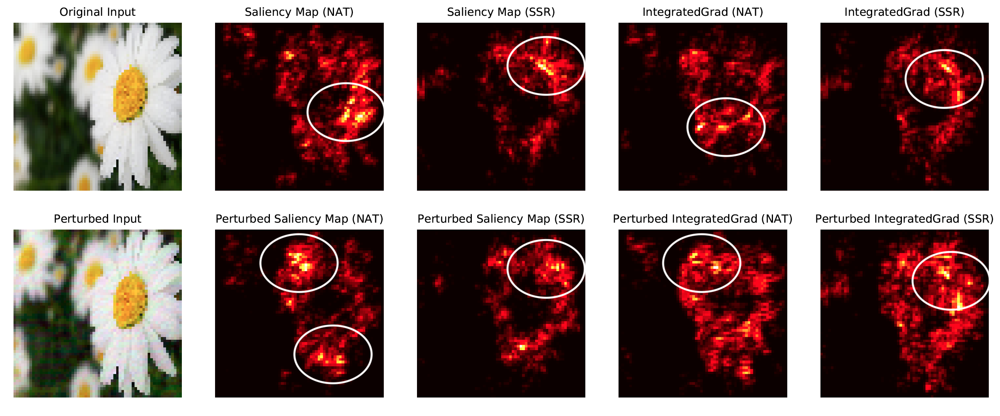

## Smoothed Geometry for Robust Attribution

See the paper on [arxiv](https://arxiv.org/pdf/2006.06643v1.pdf)

### Prerequisite 
- Tensorflow 1.15
- Pytorch

P.S.: We are working on Tensorflow 2 version for the future release. Check back later.

### Evaluating Attributions 
Use Keras
````
cd eval/keras_v1
python run_eval.py --attr_fn saliency --epsilon 2.0 --max_iters 50 --k_top 20 --pixel_max 1 --weight_file weight/pgd_5.h5 --attack_method topK --measure intersection --saving_prefix result/sweep_pgd/test_report_topK_05_
````

Use Pytorch

see notebooks under ````eval/pytorch````

### SSR Training



````
cd example
python train_smooth_cifar.py --alpha 0.3
````

